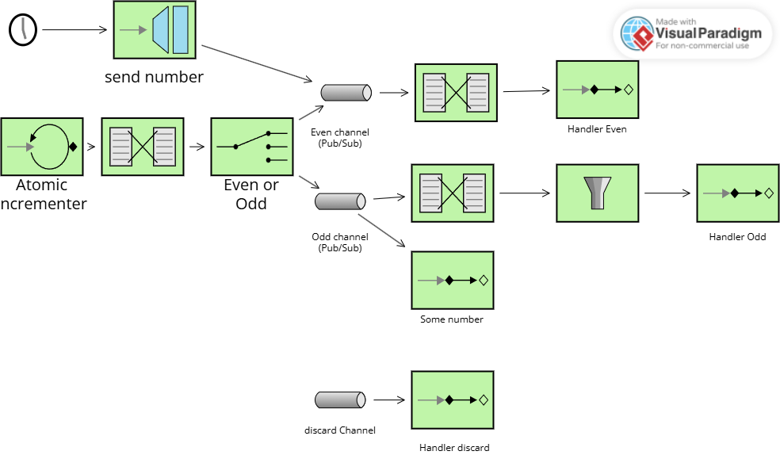

# Lab 5 Integration and SOA - Project Report

## 1. EIP Diagram (Before)

Describe what the starter code does and what problems you noticed.

#### What the starter code actually did:

* Generated sequential numbers (**0, 1, 2, 3...**) from an atomic incrementer
* Routed even numbers to `evenChannel` (**working correctly**)
* Routed odd numbers to `oddChannel` (**with issues**)
* The **Gateway injected negative numbers** into the system (**wrong channel**)

#### ❌ Problems noticed:

* **Inconsistent odd number processing**: Some odd numbers (like 1) were rejected by a filter, while others (like 3) reached the Service Activator. This indicated **load-balancing behavior** instead of publish-subscribe.
* **Negative numbers misrouted**: Gateway-injected negative numbers went to `evenChannel` instead of being processed as odd numbers.
* **Filter logic inverted**: The filter in `oddFlow` was **rejecting** odd numbers instead of accepting them.
* **Missing channel**: There was no dedicated `numberChannel` for gateway input, causing routing conflicts.
---

## 2. What Was Wrong

Explain the bugs you found in the starter code:

- **Bug 1**: What was the problem? Why did it happen? How did you fix it?
* **Problem**: `oddChannel` was a **DirectChannel** (default), which **load-balances** messages between subscribers in a round-robin fashion. This meant that odd numbers from `myFlow` would go to EITHER `oddFlow` OR `SomeService`, but **not both**.
* **Why it happened**: The code didn't explicitly declare `oddChannel` as a publish-subscribe channel.
* **Evidence in output**:
    * Odd number 1 → routed to `oddChannel` → Filter **REJECTED** it ❌
    * Odd number 3 → routed to `oddChannel` → Service Activator **received** it ✅
    * *Inconsistent behavior proved load-balancing instead of broadcasting*
* **Fix**: Changed `oddChannel` to publish-subscribe:

@Bean
fun oddChannel(): PublishSubscribeChannelSpec<*> = MessageChannels.publishSubscribe()

- **Bug 2**: What was the second problem? Why did it happen? How did you fix it?
Bug 2: Filter Logic Was Inverted
Problem: The filter in oddFlow was checking p % 2 == 0, which accepts EVEN numbers and rejects ODD numbers. This is backwards for a flow that should process odd numbers.

Why it happened: Logic error in the filter condition.

Evidence in output:

🔍 Odd Filter: checking 1 → REJECT

Odd numbers were being rejected when they should have been accepted.

Fix: Inverted the filter condition:

filter { p: Int ->
    val passes = p % 2 != 0  // Accept ODD numbers (not divisible by 2)
    logger.info("  🔍 Odd Filter: checking {} → {}", p, if (passes) "PASS" else "REJECT")
    passes
}

- **Bug 3**: What was the third problem? Why did it happen? How did you fix it?
Bug 3: Gateway Used Wrong Channel
Problem: The SendNumber gateway was configured with requestChannel = "evenChannel", directly injecting messages into the wrong processing flow.

Why it happened: Missing architectural separation - the gateway needed its own entry point to avoid interfering with the router's logic.

Evidence in output:

🚀 Gateway injecting: -76
⚙️  Even Transformer: -76 → 'Number -76'
✅ Even Handler: Processed [Number -76]
Negative numbers (which are odd) were being processed as even numbers.

Fix: Created a dedicated numberChannel and routing flow:

Kotlin

@Bean
fun numberChannel() = MessageChannels.direct()

@Bean
fun numberFlow(): IntegrationFlow =
    integrationFlow("numberChannel") {
        channel("oddChannel")
    }

@MessagingGateway
interface SendNumber {
    @Gateway(requestChannel = "numberChannel")
    fun sendNumber(number: Int)
}
Result: Gateway messages now enter through numberChannel, get routed to oddChannel, and are received directly by SomeService as Integer type (without transformation).
- **(More bugs if you found them)**

---

## 3. What You Learned

Write a few sentences about:

- What you learned about Enterprise Integration Patterns
- How Spring Integration works
- What was challenging and how you solved it

Understanding Enterprise Integration Patterns (EIP)
This assignment demonstrated how EIP provides a common vocabulary for describing message-driven architectures. Key patterns learned:

Content-Based Router: Routes messages to different channels based on their content (even/odd logic).

Publish-Subscribe Channel: Broadcasts messages to multiple subscribers simultaneously (critical for oddChannel).

Message Filter: Selectively allows messages to pass based on criteria.

Message Transformer: Converts message format (Integer → String).

Service Activator: Connects messaging infrastructure to business logic.

Messaging Gateway: Provides a clean API for injecting messages into the system.

How Spring Integration Works
Spring Integration implements EIP patterns using a declarative Kotlin DSL:

Channel types matter: The difference between direct() and publishSubscribe() channels fundamentally changes message distribution behavior.

Integration flows are composable: Each flow is a bean that can be connected to channels

Challenge,Solution
Understanding why odd numbers behaved inconsistently,Learned about channel types and how DirectChannel load-balances vs. PublishSubscribeChannel broadcasts.
Tracing message flow through multiple components,Used the logging statements with emojis to visualize the path each message takes.
Understanding why negative numbers needed separate handling,Realized that gateway-injected messages should bypass routing logic and go directly to the service without transformation.
---

## 4. AI Disclosure

**Did you use AI tools?** (ChatGPT, Copilot, Claude, etc.)

- If YES: Which tools? What did they help with? What did you do yourself?
- If NO: Write "No AI tools were used."

Copilot

Explaining the difference between DirectChannel and PublishSubscribeChannel.
Structuring the REPORT.md with clear sections.

**Important**: Explain your own understanding of the code and patterns, even if AI helped you write it.

---

## Additional Notes

Any other comments or observations about the assignment.
